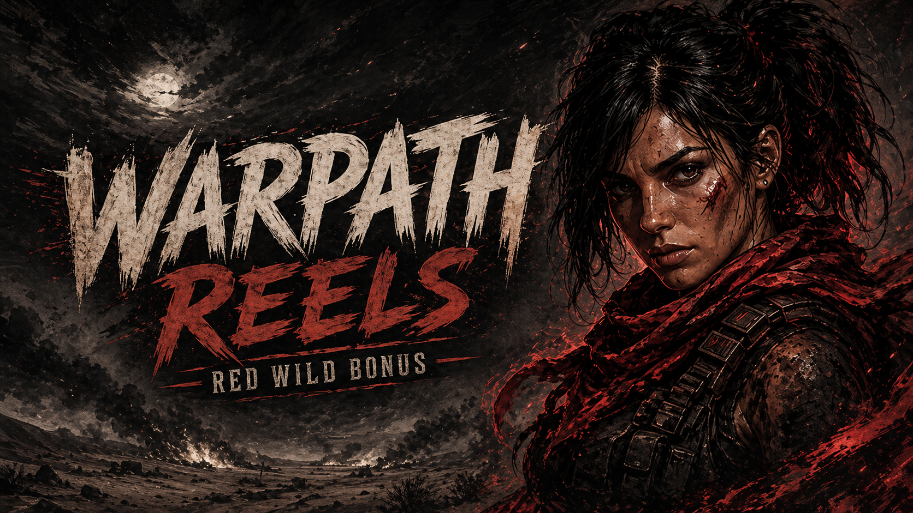
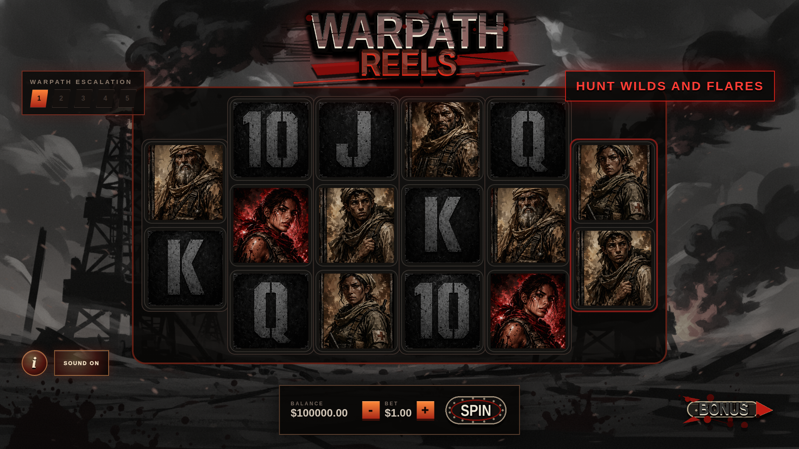

# Warpath Reels



Repository name: `spinslaughter`



`Warpath Reels` is a StakeEngine-style online slot game prototype built as a clean GitHub-ready repository with a SvelteKit + PixiJS frontend and a Python math/book-generation package.

The current build is intended for production-style integration review and local/device testing. Math certification, final compliance review, and final audio licensing are still separate release steps.

## Project Layout

```text
.
├── frontend/                  # SvelteKit + PixiJS game client
│   ├── src/lib/components/     # Main game UI, Pixi stage, audio layer
│   ├── src/lib/game/           # Book loader, event emitter, types, constants
│   └── static/                 # Assets and generated frontend book fixtures
├── math/                      # Python math engine and book generation
│   ├── library/                # Generated books, lookup tables, publish configs
│   └── warpath_math/           # Game config, state machine, reels, paytable
├── tools/                     # Asset/audio generation and processing utilities
├── README.md
├── package.json
├── pnpm-workspace.yaml
└── pnpm-lock.yaml
```

## Requirements

StakeEngine frontend docs specify Node and pnpm for the Frontend Web SDK workflow. This repo uses SvelteKit, PixiJS, and pnpm workspaces.

Recommended:

- Node.js `18.18+`
- pnpm `10.x`
- Python `3.11+`

Check local versions:

```bash
node --version
pnpm --version
python3 --version
```

## Install

```bash
pnpm install
python3 -m venv .venv
source .venv/bin/activate
pip install -r math/requirements.txt
```

## Generate Math Books

Books are generated from the Python math package and copied into the frontend static book fixture folder.

```bash
pnpm generate:books
```

Generated outputs include:

- `math/library/books/books_base.jsonl`
- `math/library/books/books_warpath_buy_8.jsonl`
- `math/library/books/books_warpath_buy_10.jsonl`
- `math/library/books/books_warpath_buy_12.jsonl`
- `math/library/lookup_tables/lookUpTable_*.csv`
- `math/library/publish_files/config_math.json`
- `math/library/publish_files/config_fe.json`
- `math/library/publish_files/math_summary.json`
- `frontend/static/books/books_*.jsonl`

## Run Locally

```bash
pnpm dev
```

Open:

```text
http://localhost:5173
```

## Test On Local Network

Useful for iPad/mobile testing:

```bash
pnpm --dir frontend dev --host 0.0.0.0
```

Then open the network URL Vite prints, for example:

```text
http://10.0.0.101:5173
```

For production-preview testing after a build:

```bash
pnpm build
pnpm --dir frontend preview --host 0.0.0.0 --port 4173
```

`pnpm build` creates the StakeEngine upload package and prunes dev-only files from `frontend/build`, including local JSONL books, source sheets, screenshots, and unused audio. Production preview therefore expects real RGS/replay URL parameters. Use `pnpm dev` for no-session local book testing.

If you specifically need an unpruned local preview build with static local books:

```bash
pnpm --dir frontend build:unpruned
pnpm --dir frontend preview --host 0.0.0.0 --port 4173
```

## Build

```bash
pnpm build
```

Static frontend output is written to:

```text
frontend/build
```

This folder is the frontend package to upload for StakeEngine frontend review.

## Game Features

- 6 reels with `2-3-3-3-3-2` layout.
- Startup attract board so the reels are populated before the first spin.
- Warpath Flare scatters trigger Warpath Spins.
- 3/4/5 scatters award 8/10/12 Warpath Spins.
- One compact bonus launcher opens buy options for 8/10/12 spins.
- Red soldier wild is the main vivid focal symbol.
- Soldier high-pay symbols are lightly washed-out color, while `10/J/Q/K` remain greyscale low pays.
- Warpath Spins wait for player input between spins.
- Sticky wild reels, cascade multiplier effects, screen shake, particles, win banners, and audio events.
- Mobile/iPad viewport scaling uses the visual viewport so the game centers instead of cropping.

## Frontend Notes

The frontend follows the StakeEngine-style book event flow:

```text
book JSONL event -> bookEventHandlerMap -> typed eventEmitter event -> Svelte/Pixi/audio component
```

Important files:

- `frontend/src/lib/components/WarpathGame.svelte`
- `frontend/src/lib/components/PixiStage.svelte`
- `frontend/src/lib/components/WarpathAudio.svelte`
- `frontend/src/lib/game/bookEventHandlers.ts`
- `frontend/src/lib/game/bookPlayer.ts`
- `frontend/src/lib/game/types.ts`

## Audio

Audio files live in:

```text
frontend/static/assets/audio
```

The manifest is:

```text
frontend/static/assets/audio/manifest.json
```

Current audio is wired into frontend events and ready for replacement with final cleared/licensed production audio.

## Asset Sources

Generated source sheets and processed game assets are stored in:

```text
frontend/static/assets/source_sheets
frontend/static/assets/symbols
frontend/static/assets/ui
frontend/static/assets/backgrounds
frontend/static/assets/particles
frontend/static/assets/animations
```

Useful regeneration scripts:

```bash
python3 tools/generate_ui_graphics.py
python3 tools/create_visual_focus_assets.py
python3 tools/generate_revised_sfx.py
```

## Simulation / Math Review

Run the math scripts from the repo root:

```bash
python3 math/simulate.py
python3 math/run.py
```

The current development summary is written to:

```text
math/library/publish_files/math_summary.json
```

## GitHub Push

If a GitHub repository already exists:

```bash
git remote add origin https://github.com/<owner>/<repo>.git
git branch -M main
git add .
git commit -m "Initial Warpath Reels game build"
git push -u origin main
```

If using GitHub CLI to create the repo:

```bash
gh repo create <owner>/<repo> --private --source . --remote origin --push
```

Use `--public` instead of `--private` only if this game should be visible publicly.

## Production Checklist

- Confirm final StakeEngine integration target and deployment packaging.
- Re-run math simulation and certification workflow.
- Replace or clear final production audio licensing.
- Review all final art rights and generated-asset usage terms.
- Validate desktop, iPad, and mobile viewport behavior.
- Run `pnpm build` before every push/release.
